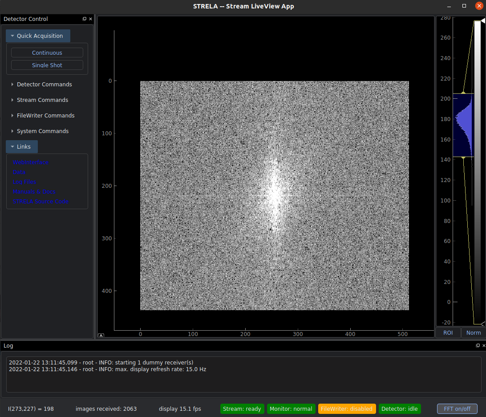

# STRELA
[STRELA](https://www.google.com/search?sxsrf=AOaemvJWgRhlxkmkfXETJ5YNG2Ifkp2HkA:1642260626630&q=strela+pass&npsic=0&rflfq=1&rldoc=1&rllag=46813032,9796434,0&tbm=lcl&sxsrf=AOaemvJWgRhlxkmkfXETJ5YNG2Ifkp2HkA:1642260626630&sa=X&ved=2ahUKEwj465zKibT1AhUFgv0HHWSZAkoQtgN6BAgEEDQ&biw=752&bih=941&dpr=1#rlfi=hd:;si:;mv:[[46.8215164122907,9.804494880124759],[46.79842991954302,9.79024698583765],null,[46.80997440460023,9.797370932981204],15]), the **STRE**am **L**iveview **A**pp, is a simple LiveViewer UI for [DECTRIS detectors](https://www.dectris.com/). STRELA is written in Python3, based on the performant [PyQtGraph](https://www.pyqtgraph.org/) scientific graphics library. The interactive viewer can consume the DECTRIS [zmq](https://zeromq.org/languages/python/) fast stream and the monitor interface as data source [(link)](https://media.dectris.com/210607-DECTRIS-SIMPLON-API-Manual_EIGER2-chip-based_detectros.pdf).

This is a just for fun, educational project. Feel free to [play with the code](./LICENSE) or to contribute.



## Functionality
* interactive LiveView via
  * ZMQ stream (ca. 10 Hz, low latency)
  * monitor interface (ca. 1 Hz)
* minimal detector control interface and status monitoring
* FFT
* zoom, pan, ROI, projection, (auto-)scaling
* control contrast, brightness, and color map 
* export images

## Run STRELA
```
python3 Strela.py [-h] [--nThreads NTHREADS] [--fps FPS] [--stream STREAM] ip

STRELA LiveView for DECTRIS detectors

positional arguments:
  ip                    DECTRIS detector IP or hostname

optional arguments:
  -h, --help            show this help message and exit
  --nThreads NTHREADS, -n NTHREADS
                        number of receiver threads
  --fps FPS, -f FPS     display refresh rate in Hz
  --stream STREAM, -s STREAM
                        interface to use: [zmq|monitor|dummy]
```
## Testing
A dummy data source can be used to test the interface without detector. An image of the Strela pass with randomly added noise is returned with approx 20Hz:
```bash
python3 Strela.py localhost -s dummy
``` 

## Dependencies
The software runs on any OS which supports python3 and Qt5:

* Python3

* UI: PyQt5, pyqtgraph, qdarktheme

* data handling: zmq, lz4, bitshuffle, tifffile, numpy

### Debian Bullseye
```
sudo apt install libhdf5-dev python3-pip bitshuffle git
pip3 install numpy tifffile lz4 zmq PyQt5 pyqtgraph qdarktheme argparse
git clone https://github.com/SaschaAndresGrimm/STRELA.git
```

## Ideas for new features
To be implemented on a rainy day:
* detector control interface
* log file viewer in UI
* h5 file input

